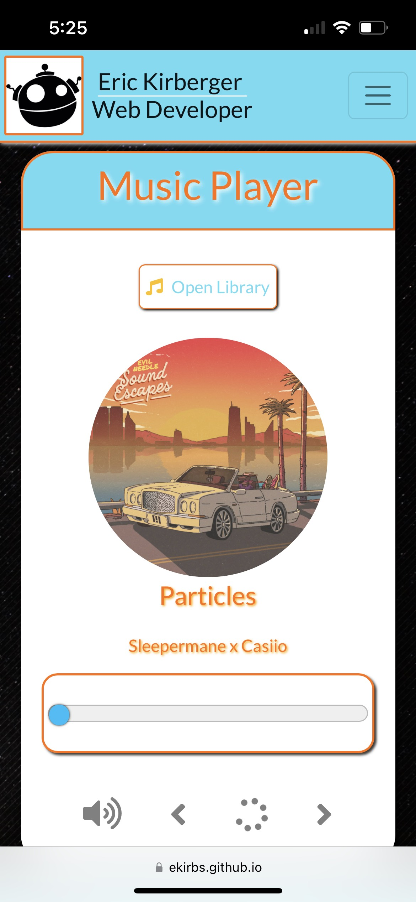
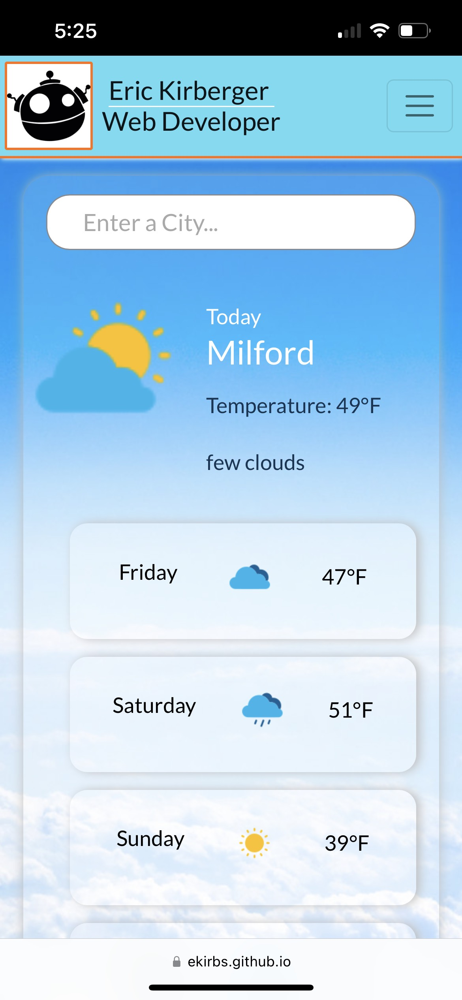
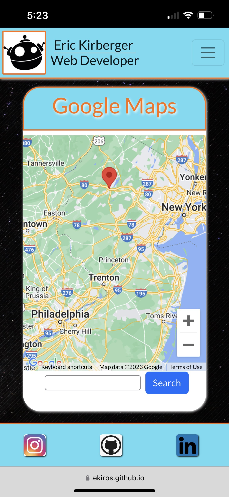

---
>## Description

Hello, and welcome to my portfolio!  My name is Eric Kirberger and I am a Full Stack Web Developer.  My focus is on Front End Development and UI/UX Design.  This mobile-first, responsive portfolio is made using React.js with a growing number of components and features, a list of which can be found below.  Please enjoy your time on my site, and feel free to contact me for anything field-related!

Link: [Deployed Portfolio](https://ekirbs.github.io/portfolio-v5/ 'My deployed portfolio, made using React.js.')

Link: [GitHub Repository](https://github.com/ekirbs/portfolio-v5/ 'The GitHub repository of my portfolio.')

 

---
>## Table of Contents

- [Installation](#installation)
- [Usage](#usage)
- [Credits](#credits)
- [License](#license)
- [Features](#features)

 

---
>## Installation

N/A.  This portfolio requires no installation. Just enjoy!

 

---
>## Usage

The navigation bar can always be found in the top right corner of the screen.  Just click on the menu button and a dropdown list provides links to different sections:

  - **Home** - back to the top we go!
  - **My Work** - a showcase of my skills and a display of the various technologies I've used so far.
  - **About Me** - learn an little about me, where I've learned my skills, and what I've done in the past with a downloadable pdf of my resume.
  - **Contact** - information on how where and how to find me, and a footer with some additional personal links like Instagram, LinkedIn, and GitHub.

 

### ***Ex-Current Fun Stuff (none of this is here, section to be fixed soon!):***

| Title            | Description | Image                                                                   |
| :--------------- | :---------: | ----------------------------------------------------------------------: |
| Music Player     | A web music player app to listen to chill lofi songs.  The song list is subject to change. |      |
| Weather Forecast | A weather forecast app using the OpenWeatherMap API.  Search for any city and get a 5-day forecast of the weather.  The information given is subject to change. |  |
| Google Maps      | A Google global map app using the Google Maps API.  The map display is fully touch-capable.  Search for any location and the map will pinpoint the location.  The functionality is subject to change. |       |
 

)

 

---
>## Credits

A special thanks to the developers of the packages I've utilized on this site through Node Package Manager(**npm**):

Link: [React Google Maps API](https://www.npmjs.com/package/@react-google-maps/api 'A google maps package using the Google Maps API.') - Google Maps by JustFly1984

 

---
>## License

 

This application has an MIT license.  This is a short and simple permissive license with conditions only requiring preservation of copyright and license notices.  For more information please refer to the license located in the github repository.

 

---
>## Badges

 

 

---
>## Features

- My Work - some of the projects I've built, displayed in a component I built
  - the links taks you to the deployed app and the github repo
- Technologies - some of the technologies I've worked with
  - hover over them on desktop for the name
- About Me - a brief look at the man
- My Resume - a summary of professional resume with an option to download my full resume in a pdf
- Contact Me - my business contact information
  - the Google Maps is right now just generally centered on my region in the world
  - the contact form should work, if you so choose.  It will send me an email.